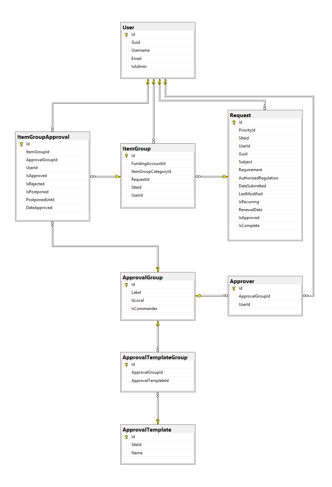
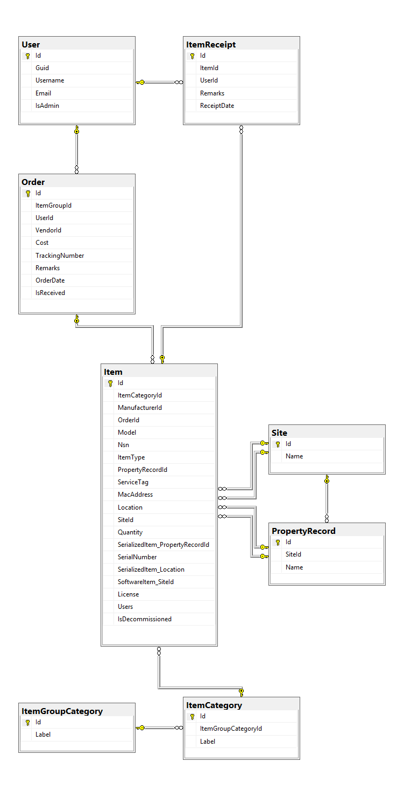

# Process Planning Notes

## Planning Notes
* Plan for how deletion of rows would affect existing records, and how to best mitigate side effects  

## In Progress  

* Inventory Management for Serialized Items / Hardware
* Serialized Item / Hardware Transfers
* Site NonSerialized Item Management
    * NonSerialized Item Hand Receipts
* Destruction / Decommissioning of Items

## Developed  

### Core 
* `LogUser.cs`
* `Site.cs`
* `User.cs`  

### Request
* `Attachment.cs - RequestAttachment`
* `Priority.cs`
* `Request.cs`
* `RequestItem.cs`
#### Supplemental Tables
* `LogUser.cs`
* `Site.cs`
* `User.cs`  

***

### Item Groups
* `ItemGroup.cs`
* `ItemGroupCategory.cs`
#### Supplemental Tables
* `Request.cs`
* `RequestItem.cs`
* `Site.cs`
* `User.cs`  

***

### Funding
* `FundingAccount.cs`
* `FundTransaction.cs`
* `FundUser.cs`
#### Supplemental Tables
* `ItemGroup.cs`
* `Order.cs`
* `User.cs`  

***

### Approval Groups and Templates
* `ApprovalGroup.cs`
* `ApprovalTemplate.cs`
* `ApprovalTemplateGroup.cs`
* `Approver.cs`
* `ItemGroupApproval.cs`
#### Supplemental Tables
* `ItemGroup.cs`
* `Request.cs`
* `User.cs`  

***

### Order Placement
* `Order.cs`
* `Vendor.cs`
#### Supplemental Tables
* `ItemGroup.cs`
* `User.cs`  

***

### Receipt of Orders
* `Item.cs`
* `ItemCategory.cs`
* `ItemReceipt.cs`
#### Supplemental Tables
* `ItemGroupCategory.cs`
* `PropertyRecord.cs`
* `Order.cs`
* `Site.cs`
* `User.cs`  

***

### Property Records
* `Item.cs`
* `PropertyRecord.cs`
* `PropertyCustodian.cs`
#### Supplemental Tables
* `Order.cs`
* `Site.cs`
* `User.cs`  

